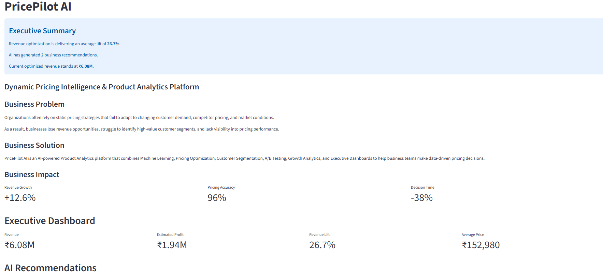
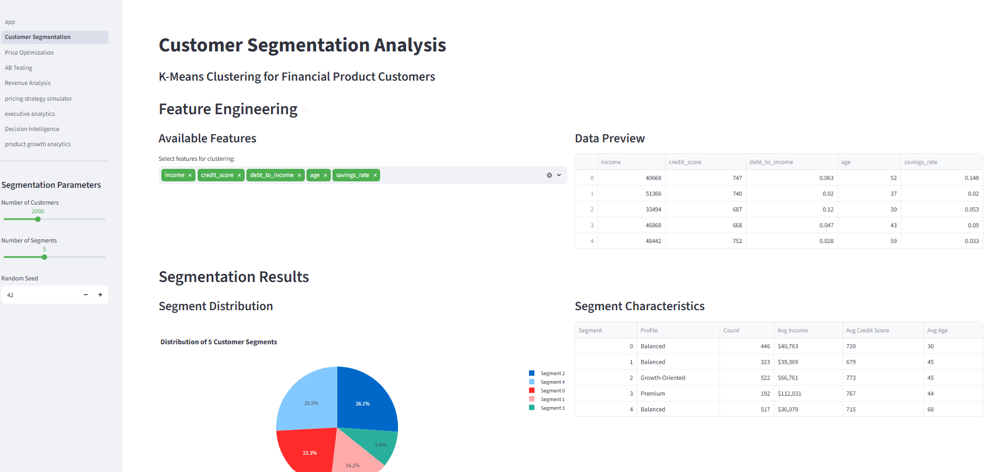
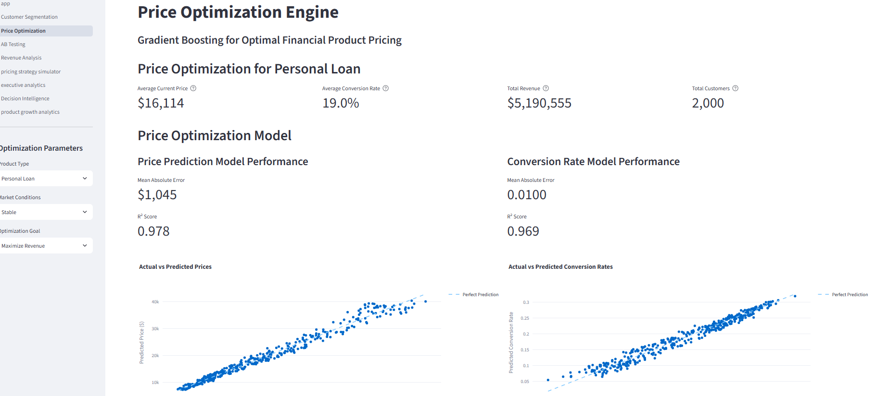
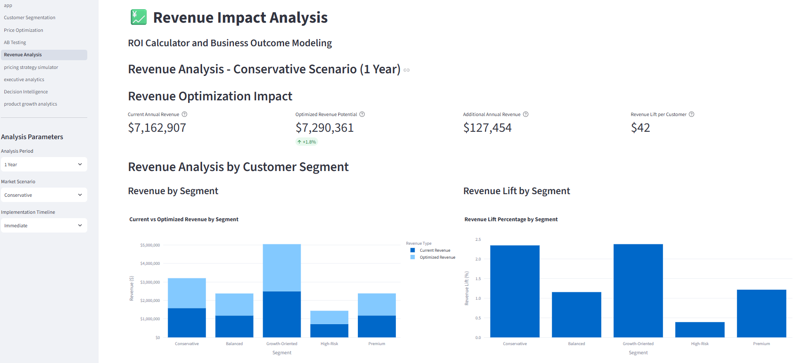
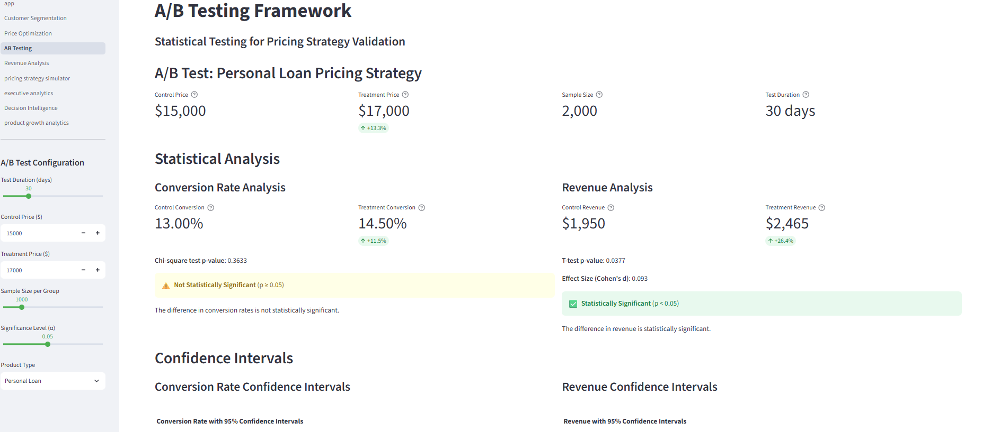
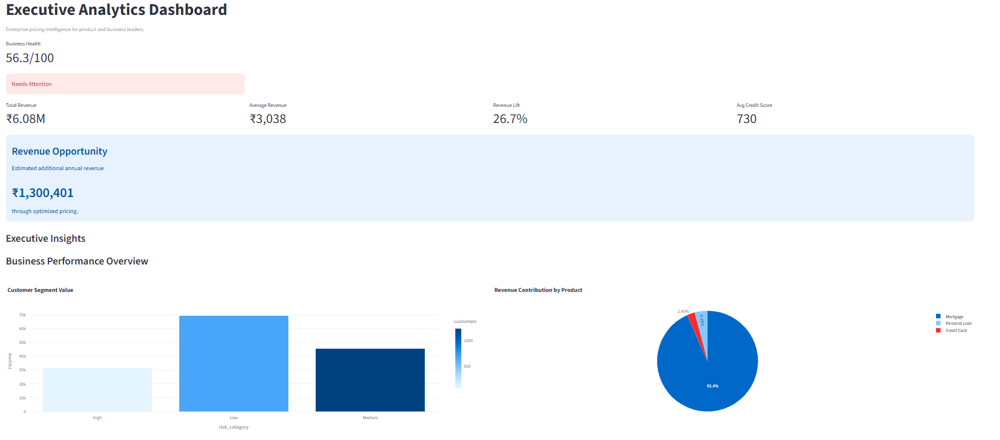
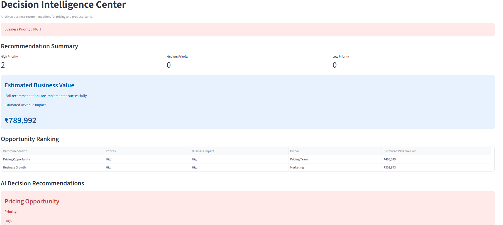
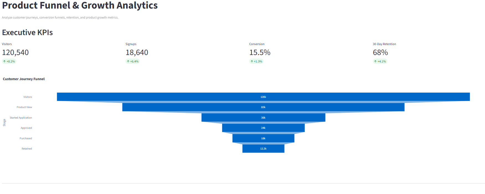

# PricePilot AI

> AI-powered Dynamic Pricing Intelligence & Product Analytics Platform

PricePilot AI is an end-to-end product analytics platform that helps businesses optimize product pricing using Machine Learning, customer segmentation, experimentation, and business intelligence.

The platform combines predictive analytics with executive dashboards to enable product managers and business teams to make data-driven pricing decisions.

---

# Business Problem

Traditional pricing strategies often rely on manual rules and historical intuition.

This leads to:

- Lost revenue opportunities
- Poor customer segmentation
- Low pricing accuracy
- Inefficient experimentation
- Limited visibility into business performance

Organizations require a centralized platform capable of analyzing customer behavior, market trends, pricing experiments, and revenue impact in real time.

---

# Solution

PricePilot AI addresses these challenges by combining:

- Machine Learning based Price Optimization
- Customer Segmentation
- Revenue Analytics
- A/B Testing Framework
- Pricing Strategy Simulator
- Executive Analytics Dashboard
- Decision Intelligence Engine
- Product Funnel & Growth Analytics

The platform enables product managers to identify pricing opportunities, estimate business impact, analyze customer journeys, and monitor growth metrics.

---

# Key Features

## Customer Segmentation

- K-Means clustering
- Customer profiling
- Risk categorization
- Segment visualization

---

## Dynamic Price Optimization

- Gradient Boosting Regressor
- Optimal price prediction
- Revenue estimation
- Conversion prediction

---

## Revenue Analytics

- Revenue Lift Analysis
- Product Performance
- Revenue Distribution
- Customer Value Analysis

---

## A/B Testing Framework

- Pricing experiment comparison
- Statistical significance
- Confidence estimation
- Revenue impact analysis

---

## Pricing Strategy Simulator

Interactive simulator supporting:

- Competitor pricing
- Customer demand
- Inventory
- Marketing spend
- Seasonal effects

Outputs include:

- Recommended Price
- Expected Revenue
- Expected Profit
- Revenue Lift
- Executive Recommendation

---

## Executive Analytics Dashboard

Business KPIs including:

- Revenue
- Revenue Lift
- Average Selling Price
- Business Health Score

Visualizations include:

- Product Contribution
- Customer Segments
- Risk Distribution
- Interest Rate Trends

---

## Decision Intelligence Center

AI-generated recommendations with:

- Priority
- Business Impact
- Confidence Score
- Estimated Revenue Gain
- Recommendation Owner
- Executive Action Plan

---

## Product Funnel & Growth Analytics

Tracks customer journey across:

Visitors

↓

Product View

↓

Started Application

↓

Approved

↓

Purchased

↓

Retained

Includes:

- Funnel Conversion
- Growth Metrics
- Feature Impact Analysis
- AI Product Insights

---

# Machine Learning Pipeline

```
Customer Data
       │
       ▼
Data Generation
       │
       ▼
Feature Engineering
       │
       ▼
Customer Segmentation
       │
       ▼
Price Optimization Model
       │
       ▼
Revenue Prediction
       │
       ▼
Decision Intelligence
       │
       ▼
Executive Dashboard
```

---

# System Architecture

```
Streamlit UI

│

├── Services
│   ├── Data Service
│   ├── Analytics Service
│   ├── Recommendation Service
│   ├── Pricing Service
│   └── Model Service
│
├── Machine Learning Models
│   ├── Customer Segmentation
│   └── Price Optimizer
│
├── Synthetic Data Generator
│
└── Business Dashboards
```

---

# Tech Stack

### Frontend

- Streamlit
- Plotly

### Machine Learning

- Scikit-Learn
- Gradient Boosting
- K-Means

### Data Processing

- Pandas
- NumPy

### Programming Language

- Python

---

# Project Structure

```
PricePilot-AI
│
├── app.py
│
├── pages
│   ├── Customer Segmentation
│   ├── Price Optimization
│   ├── A/B Testing
│   ├── Revenue Analysis
│   ├── Pricing Strategy Simulator
│   ├── Executive Analytics
│   ├── Decision Intelligence
│   └── Product Funnel & Growth Analytics
│
├── services
│   ├── analytics_service.py
│   ├── data_service.py
│   ├── model_service.py
│   ├── pricing_service.py
│   └── recommendation_service.py
│
├── utils
│   ├── data_generator.py
│   ├── metrics.py
│   └── models.py
│
├── assets
│
├── requirements.txt
│
└── README.md
```

---

# Screenshots

## Home Dashboard



---

## Customer Segmentation



---

## Price Optimization



---

## Revenue Analytics



---

## A/B Testing



---

## Pricing Strategy Simulator


---

## Executive Analytics



---

## Decision Intelligence



---

## Product Funnel & Growth Analytics



---

# Installation

Clone the repository

```bash
git clone https://github.com/Kaniishk005/Dynamic-Pricing-Optimization.git
```

Navigate to the project

```bash
cd Dynamic-Pricing-Optimization
```

Install dependencies

```bash
pip install -r requirements.txt
```

Run the application

```bash
streamlit run app.py
```

---

# Future Enhancements

- Real-world pricing datasets
- Demand forecasting using time-series models
- Customer Lifetime Value prediction
- Cohort analysis
- Churn prediction
- Personalized pricing recommendations
- Explainable AI for pricing decisions
- Cloud deployment on AWS/Azure
- REST API integration
- Automated monitoring and alerting

---

# Business Impact

PricePilot AI demonstrates how Product Analytics and Machine Learning can work together to improve business decision-making.

The platform helps organizations:

- Optimize pricing strategies
- Increase revenue
- Improve conversion
- Analyze customer journeys
- Evaluate product features
- Monitor business performance
- Generate executive recommendations
- Support data-driven product decisions

---

# Author

**Kanishk Tiwari**

Computer Science Undergraduate

GitHub:
https://github.com/Kaniishk005

---